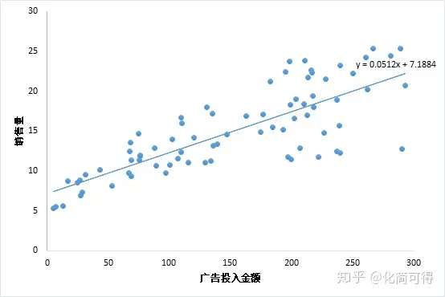

# 西瓜书笔记

## 诸论

这里主要以故事形式讲解了机器学习的本质

用以前老师的话总结：**机器学习就是数值逼近**

## 模型评估

这里跟我的课程的学习路线不同，这里总体介绍了3部分的内容：**训练/验证集划分**、**性能指标**、**比较检验**

大概率是总体说明后，方便我们在后续章节使用的时候来回翻一翻。

其中最容易理解的就是**训练/验证集划分**，也是最容易理解，后续可能使用的最多的。主要介绍了K折划分、留出法、随机采样三大类

**性能指标**后续结合一些例子就容易理解了，其中的ROC曲线存在一条基准线，在分类问题中指代随机分类这一分类器的性能

**比较检验**，没有详细阅读，主要是概率论中的检验部分的内容，等后续接触举例的例子后再反过来看。

评论：前两章的笔记比较简单，因为13号早上有一门考试，这两天正在复习，等后续有时间了结合后面的例子继续完善这部分的内容。

## 线性模型

基本形式为

$$f(x)=w^Tx+b$$

或者写成

$$f(x)=W^TX$$

$X$为$x|b$，即增广形式

线性模型即为多属性的线性关系，为什么是线性？

在多元空间中很难理解，但是在二维空间内，基本形式就是$f(x)=ax+b$，其就是一条直线，换到多维空间中，基本形式就是表示的多维空间中的“线”。

图示可以显示为如下示例

（源：https://zhuanlan.zhihu.com/p/72513104）

有了模型后就需要考虑目标了

最简单的目标函数也是最经典的就是均方误差，其也可以称为最小二乘法

$$(w^*,b^*)=\mathop{\arg\max}\limits_{(w,b)}\sum_{i=1}^m(y_i-wx_i-b)^2$$

这里可以通过分别对$w,b$求导来得到目标函数的最小值（因为目标函数的特性很好，是凸函数，所以直接可以得到最值点）

多元情况下

$$\hat{w}^*=\mathop{\arg\max}\limits_{\hat{w}}(\pmb{y}-\pmb{X\hat{w}})^T(\pmb{y}-\pmb{X\hat{w}})$$

对$\hat{w}$求导即可得到最终解

但是如果$X$不是方阵时，求逆变成了求伪逆，这里可以采用特征值分解的方式来求解。

### 对数几率回归

其实本质上还是线性模型，但是通过一个可逆的函数来把目标与属性关联起来，构造一个广义线性模型，对数几率回归使用的函数就是$f(x)=\frac{1}{1+e^{-x}}$

最终得到的模型就是

$$f(X)=\frac{1}{1+e^{-W^TX}}$$

广义线性模型的形式为

$$f(X)=g^{-1}(W^TX)$$

这里后面的部分可以看懂，但是不是很好理解为什么转移到概率上，待后续回看的时候再理解

## 判别分析

Fisher判别，在另一个角度看，其实是一种数据降维的手段

把高维的数据映射到一个低维上，通过设定目标函数，让数据区分度最高

这里很有意思的是，我们的目标是要让投影后的点，同一类的类内要尽量挨在一起，不同类的类中心要离得远一点，于是我们这样定义目标函数

$$J=\frac{\parallel w^T\mu_0-w^T\mu_1 \parallel_2^2}{w^T(\Sigma_0+\Sigma_1)w}$$

其中分母表示同一类的类内的距离，分子表示不同类的类中心的距离

化简的写法

$$J=\frac{w^TS_bw}{w^TS_ww}$$

把这个称为$S_b$与$S_w$的广义瑞利商

最终可以通过拉格朗日乘子法可以求解得到$w$的解

以上讨论了两类的分类判别，也可以推广到多类的判别，只需要改一下分子分母的形式即可，最后的解法都是一样的，只是约束多了一些，且都是等式约束

## 第三章最后提到了两个问题

### 多分类学习

即如何将两分类推广到多分类

这里没有细看，因为事件原因，且对于这部分自己已经有一些了解了

### 类别不平衡问题

讲了3中解决办法，其中前两种在第二章中又涉及到

第三种暂时不是很理解，但是感觉跟后续的实操有关，放在后面去理解消化。

## 决策树

谈到决策树，其类似于我们的代码中的if-else语句

那么为了度量我们的分割或者说决策是否是有效的，我们提出了一个**信息熵**的概念

假设一个特征的值服从某种概率分布

信息熵可以表示为

$$Ent(D)=-\sum_{k=0}^{\vert \mathcal{Y} \vert}p_k\log_2p_k$$

其中$Ent(D)$的值越小代表值越精确，越确定

其中这个概念放在我们的样本的特征中，对于$\mathcal{Y}$个类的某特征，其信息熵的概念就表示这个特征越纯净

通过决策树进行样本集的划分后，得到信息熵的增量，即信息熵增$Gain(D,a)$

$$Gain(D,a)=Ent(D) - \sum_{v=1}^{V}\frac{\vert D^v \vert}{\vert D \vert}Ent(D^v)$$

其中$\frac{\vert D^v \vert}{\vert D \vert}$代表第$v$个集合的权重，此处是按照样本数来赋权

因此我们就可以得到一个算法，通过遍历某个样本集的所有特征，把按照特征取值计算出所有的$Gain(D,a)$的最大值，也就是性能最好的划分，然后递归划分即可

**这样的划分有问题吗？**

很明显，我把每个样本单独划为一类岂不是最完美的划分？

因此改进后得到另一种算法：增益率

$$Gain\_ratio(D,a)=\frac{Gain(D,a)}{IV(a)}$$

其中

$$IV(a)=-\sum_{v=1}^{V}\frac{\vert D^v \vert}{\vert D \vert}\log_2\frac{\vert D^v \vert}{\vert D \vert}$$

但是这个算法会更偏向于选择取值数目较少的特征

### Gini指数

$$Gini(D) = \sum_{k=1}^{\vert \mathcal{Y} \vert}\sum_{k'\neq{k}}p_kp_{k'}$$

具体的可能要在使用后才能体会

### 剪枝

分为**预剪枝**与**后剪枝**

区别上，后剪枝得到的结果的欠拟合风险小，但是其训练量大，因为他是自底向上对非叶子节点逐一考察

### 连续值处理

划分区间解决，中位数等等方法

### 缺失值处理

将上述公式推广为如下形式

$$Gain(D,a)=\rho * Gain(\tilde{D},a)$$

$$Gain(\tilde{D},a)=Ent(\tilde{D}) - \sum_{v=1}^{V}\tilde{r_v}Ent(\tilde{D}^v)$$

$$Ent(\tilde{D})=-\sum_{k=1}^{\vert \mathcal{Y} \vert}\tilde{p_k}\log_2\tilde{p_k}$$

其中$\rho$表示无缺失值样本所占比例，$\tilde{p_k}$表示无缺失值样本中第$k$类所占比例，$\tilde{r_v}$表示无缺失值样本中在该特征上取值为$a^v$的样本所占的比例

### 多变量决策树

不再是直线的切分，而是使用多特征的组合式的条件，在图形中就可以表示为，斜线进行切分，甚至可以形成曲线进行切分

